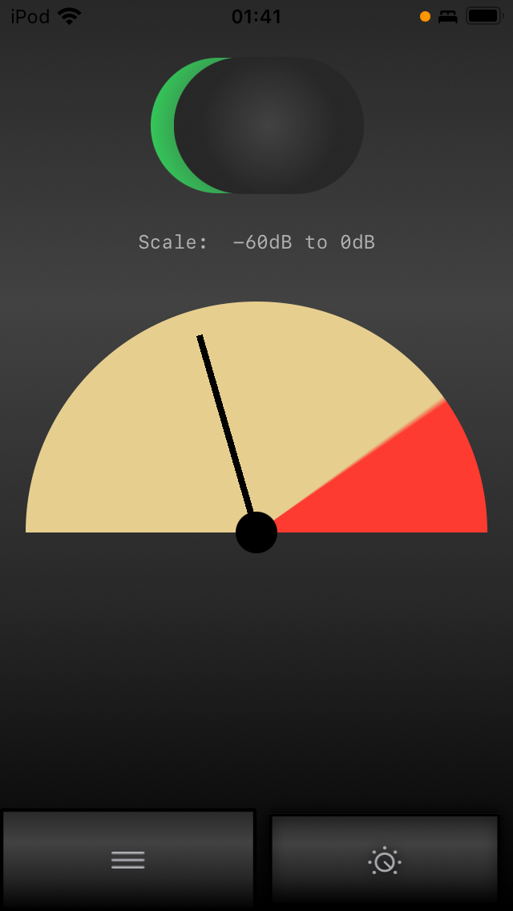
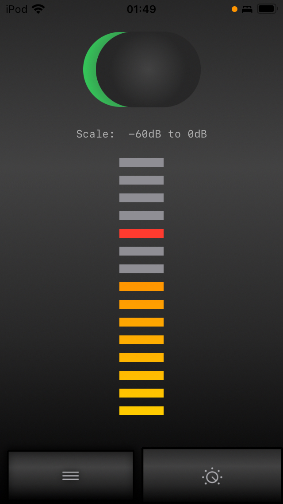

#  VUMote – Analog and Digital VU-Meter App

This iOS app shows the current volume around you on a VU meter. There are two views: VFD or needle.

You can switch between showing the full scale (-120dB) or half scale (-60dB).

The name is a combination of VU Meter and Remote, because it was intended to also offer playback controls. However, this feature is not implemented yet.  

# License

MIT.
